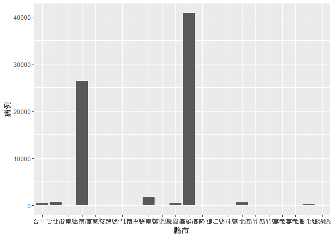

台灣各地區登革熱分析
================

讀入台灣登革熱資料
------------------

``` r
#這是R Code Chunk
library(readr)
```

    ## Warning: package 'readr' was built under R version 3.3.3

``` r
Age_County_Gender_061 <- read.csv("C:/Users/user/Downloads/Age_County_Gender_061.csv",fileEncoding = "big5")
```

資料處理與清洗
--------------

``` r
#這是R Code Chunk
library(dplyr)
```

    ## Warning: package 'dplyr' was built under R version 3.3.3

    ## 
    ## Attaching package: 'dplyr'

    ## The following objects are masked from 'package:stats':
    ## 
    ##     filter, lag

    ## The following objects are masked from 'package:base':
    ## 
    ##     intersect, setdiff, setequal, union

``` r
Age_County_Gender_061F<-Age_County_Gender_061[grepl("F",Age_County_Gender_061$性別),]
Age_County_Gender_061F<-select(Age_County_Gender_061F,發病年份:確定病例數,-是否為境外移入)
Age_County_Gender_061F<-rename(Age_County_Gender_061F,女生=性別)
Age_County_Gender_061M<-Age_County_Gender_061[grepl("M",Age_County_Gender_061$性別),]
Age_County_Gender_061M<-select(Age_County_Gender_061M,發病年份:確定病例數,-是否為境外移入)
Age_County_Gender_061M<-rename(Age_County_Gender_061M,男生=性別)
a<-full_join(Age_County_Gender_061F,Age_County_Gender_061M,by=c("發病年份","發病月份","縣市","鄉鎮","年齡層"))

knitr::kable(head(Age_County_Gender_061F,50))
```

|     | 發病年份 | 發病月份 | 縣市   | 鄉鎮   | 女生 | 年齡層 | 確定病例數 |
|-----|:--------:|:--------:|:-------|:-------|:-----|:-------|:----------:|
| 3   |   2003   |    11    | 高雄市 | 三民區 | F    | 45-49  |      1     |
| 5   |   2004   |    11    | 屏東縣 | 屏東市 | F    | 5-9    |      1     |
| 6   |   2004   |    12    | 屏東縣 | 屏東市 | F    | 25-29  |      1     |
| 9   |   2005   |    11    | 花蓮縣 | 光復鄉 | F    | 30-34  |      1     |
| 10  |   2005   |    11    | 高雄市 | 三民區 | F    | 40-44  |      2     |
| 12  |   2006   |    10    | 台南市 | 南區   | F    | 45-49  |      2     |
| 18  |   2006   |    11    | 高雄市 | 苓雅區 | F    | 55-59  |      1     |
| 19  |   2006   |    11    | 高雄市 | 鼓山區 | F    | 65-69  |      1     |
| 22  |   2006   |     4    | 嘉義市 | 西區   | F    | 60-64  |      1     |
| 25  |   2006   |     7    | 高雄市 | 前鎮區 | F    | 15-19  |      2     |
| 26  |   2006   |     7    | 高雄市 | 前鎮區 | F    | 20-24  |      2     |
| 27  |   2006   |     8    | 高雄市 | 前鎮區 | F    | 50-54  |      3     |
| 28  |   2007   |     1    | 桃園市 | 楊梅區 | F    | 45-49  |      1     |
| 32  |   2007   |    11    | 台南市 | 安南區 | F    | 55-59  |      2     |
| 34  |   2007   |    12    | 台南市 | 北區   | F    | 50-54  |      1     |
| 36  |   2007   |    12    | 台南市 | 安南區 | F    | 35-39  |      1     |
| 40  |   2007   |     9    | 台南市 | 中西區 | F    | 5-9    |      1     |
| 42  |   2008   |     1    | 台南市 | 南區   | F    | 30-34  |      1     |
| 44  |   2008   |    10    | 高雄市 | 楠梓區 | F    | 55-59  |      1     |
| 48  |   2008   |     3    | 新北市 | 林口區 | F    | 5-9    |      1     |
| 49  |   2008   |     8    | 高雄市 | 楠梓區 | F    | 65-69  |      2     |
| 50  |   2008   |     9    | 台中市 | 太平區 | F    | 50-54  |      1     |
| 51  |   2008   |     9    | 高雄市 | 鼓山區 | F    | 60-64  |      1     |
| 52  |   2009   |     1    | 新北市 | 永和區 | F    | 35-39  |      1     |
| 56  |   2009   |    12    | 台北市 | 萬華區 | F    | 25-29  |      1     |
| 57  |   2009   |    12    | 屏東縣 | 內埔鄉 | F    | 40-44  |      1     |
| 62  |   2009   |     4    | 台北市 | 松山區 | F    | 25-29  |      1     |
| 66  |   2009   |     8    | 高雄市 | 小港區 | F    | 65-69  |      2     |
| 68  |   2010   |    10    | 台南市 | 中西區 | F    | 40-44  |      2     |
| 71  |   2010   |    10    | 台南市 | 南區   | F    | 55-59  |      1     |
| 74  |   2010   |    10    | 高雄市 | 前金區 | F    | 5-9    |      1     |
| 75  |   2010   |    10    | 高雄市 | 苓雅區 | F    | 40-44  |      2     |
| 76  |   2010   |    10    | 高雄市 | 苓雅區 | F    | 45-49  |      1     |
| 77  |   2010   |    10    | 高雄市 | 新興區 | F    | 40-44  |      2     |
| 79  |   2010   |    11    | 台南市 | 東區   | F    | 50-54  |      1     |
| 80  |   2010   |    11    | 台南市 | 新營區 | F    | 25-29  |      1     |
| 82  |   2010   |    11    | 台南市 | 關廟區 | F    | 55-59  |      1     |
| 84  |   2010   |    11    | 高雄市 | 楠梓區 | F    | 25-29  |      1     |
| 86  |   2010   |    12    | 台南市 | 北區   | F    | 65-69  |      1     |
| 88  |   2010   |    12    | 高雄市 | 旗津區 | F    | 40-44  |      1     |
| 94  |   2010   |     8    | 台北市 | 松山區 | F    | 20-24  |      1     |
| 97  |   2010   |     9    | 台南市 | 中西區 | F    | 40-44  |      1     |
| 106 |   2004   |    12    | 屏東縣 | 屏東市 | F    | 50-54  |      2     |
| 107 |   2004   |    12    | 高雄市 | 大寮區 | F    | 45-49  |      1     |
| 108 |   2004   |     7    | 屏東縣 | 里港鄉 | F    | 30-34  |      1     |
| 110 |   2005   |    11    | 高雄市 | 大寮區 | F    | 30-34  |      1     |
| 113 |   2005   |     6    | 桃園市 | 平鎮區 | F    | 25-29  |      1     |
| 119 |   2006   |    10    | 基隆市 | 信義區 | F    | 35-39  |      1     |
| 122 |   2006   |    11    | 高雄市 | 苓雅區 | F    | 65-69  |      2     |
| 123 |   2006   |    11    | 高雄市 | 鳳山區 | F    | 50-54  |      1     |

``` r
knitr::kable(head(Age_County_Gender_061M,50))
```

|     | 發病年份 | 發病月份 | 縣市   | 鄉鎮   | 男生 | 年齡層 | 確定病例數 |
|-----|:--------:|:--------:|:-------|:-------|:-----|:-------|:----------:|
| 1   |   2003   |     1    | 高雄市 | 楠梓區 | M    | 60-64  |      1     |
| 2   |   2003   |    10    | 台北市 | 中正區 | M    | 40-44  |      1     |
| 4   |   2004   |    10    | 屏東縣 | 屏東市 | M    | 70+    |      6     |
| 7   |   2004   |    12    | 高雄市 | 大社區 | M    | 20-24  |      1     |
| 8   |   2004   |     8    | 台北市 | 中山區 | M    | 35-39  |      1     |
| 11  |   2005   |     8    | 高雄市 | 小港區 | M    | 30-34  |      1     |
| 13  |   2006   |    10    | 高雄市 | 三民區 | M    | 40-44  |      3     |
| 14  |   2006   |    10    | 高雄市 | 三民區 | M    | 45-49  |      2     |
| 15  |   2006   |    10    | 高雄市 | 前鎮區 | M    | 15-19  |      4     |
| 16  |   2006   |    10    | 高雄市 | 鳥松區 | M    | 35-39  |      1     |
| 17  |   2006   |    11    | 高雄市 | 左營區 | M    | 35-39  |      1     |
| 20  |   2006   |    12    | 高雄市 | 苓雅區 | M    | 65-69  |      1     |
| 21  |   2006   |     3    | 台南市 | 善化區 | M    | 45-49  |      1     |
| 23  |   2006   |     5    | 台北市 | 中正區 | M    | 30-34  |      1     |
| 24  |   2006   |     7    | 高雄市 | 前金區 | M    | 15-19  |      2     |
| 29  |   2007   |    10    | 台南市 | 中西區 | M    | 35-39  |      6     |
| 30  |   2007   |    10    | 台南市 | 北區   | M    | 15-19  |      8     |
| 31  |   2007   |    10    | 台南市 | 關廟區 | M    | 70+    |      2     |
| 33  |   2007   |    11    | 高雄市 | 鳳山區 | M    | 10-14  |      2     |
| 35  |   2007   |    12    | 台南市 | 北區   | M    | 5-9    |      2     |
| 37  |   2007   |    12    | 台南市 | 安南區 | M    | 45-49  |      3     |
| 38  |   2007   |    12    | 台南市 | 南區   | M    | 45-49  |      1     |
| 39  |   2007   |     8    | 高雄市 | 前金區 | M    | 35-39  |      1     |
| 41  |   2007   |     9    | 台南市 | 東區   | M    | 60-64  |      3     |
| 43  |   2008   |    10    | 高雄市 | 前鎮區 | M    | 25-29  |      1     |
| 45  |   2008   |    10    | 高雄市 | 鳳山區 | M    | 25-29  |      1     |
| 46  |   2008   |    11    | 高雄市 | 鳳山區 | M    | 55-59  |      2     |
| 47  |   2008   |     3    | 高雄市 | 楠梓區 | M    | 35-39  |      1     |
| 53  |   2009   |    10    | 高雄市 | 前鎮區 | M    | 70+    |      4     |
| 54  |   2009   |    11    | 屏東縣 | 長治鄉 | M    | 45-49  |      1     |
| 55  |   2009   |    11    | 高雄市 | 三民區 | M    | 35-39  |      1     |
| 58  |   2009   |    12    | 高雄市 | 前鎮區 | M    | 50-54  |      3     |
| 59  |   2009   |    12    | 高雄市 | 苓雅區 | M    | 20-24  |      1     |
| 60  |   2009   |    12    | 高雄市 | 苓雅區 | M    | 55-59  |      1     |
| 61  |   2009   |     3    | 屏東縣 | 新園鄉 | M    | 20-24  |      1     |
| 63  |   2009   |     6    | 彰化縣 | 二林鎮 | M    | 60-64  |      1     |
| 64  |   2009   |     7    | 新北市 | 永和區 | M    | 10-14  |      1     |
| 65  |   2009   |     8    | 台北市 | 松山區 | M    | 60-64  |      1     |
| 67  |   2009   |     9    | 台北市 | 松山區 | M    | 25-29  |      1     |
| 69  |   2010   |    10    | 台南市 | 永康區 | M    | 55-59  |      1     |
| 70  |   2010   |    10    | 台南市 | 東區   | M    | 70+    |      1     |
| 72  |   2010   |    10    | 台南市 | 關廟區 | M    | 25-29  |      2     |
| 73  |   2010   |    10    | 台南市 | 關廟區 | M    | 60-64  |      2     |
| 78  |   2010   |    11    | 台南市 | 中西區 | M    | 10-14  |      1     |
| 81  |   2010   |    11    | 台南市 | 龍崎區 | M    | 45-49  |      1     |
| 83  |   2010   |    11    | 高雄市 | 前鎮區 | M    | 50-54  |      2     |
| 85  |   2010   |    11    | 高雄市 | 鳳山區 | M    | 30-34  |      4     |
| 87  |   2010   |    12    | 台南市 | 關廟區 | M    | 65-69  |      1     |
| 89  |   2010   |     5    | 苗栗縣 | 頭份市 | M    | 50-54  |      1     |
| 90  |   2010   |     5    | 高雄市 | 大寮區 | M    | 40-44  |      1     |

``` r
knitr::kable(head(a,50))
```

| 發病年份 | 發病月份 | 縣市   | 鄉鎮   | 女生 | 年齡層 | 確定病例數.x | 男生 | 確定病例數.y |
|:--------:|:--------:|:-------|:-------|:-----|:-------|:------------:|:-----|:------------:|
|   2003   |    11    | 高雄市 | 三民區 | F    | 45-49  |       1      | NA   |      NA      |
|   2004   |    11    | 屏東縣 | 屏東市 | F    | 5-9    |       1      | M    |       1      |
|   2004   |    12    | 屏東縣 | 屏東市 | F    | 25-29  |       1      | NA   |      NA      |
|   2005   |    11    | 花蓮縣 | 光復鄉 | F    | 30-34  |       1      | NA   |      NA      |
|   2005   |    11    | 高雄市 | 三民區 | F    | 40-44  |       2      | M    |       1      |
|   2006   |    10    | 台南市 | 南區   | F    | 45-49  |       2      | NA   |      NA      |
|   2006   |    11    | 高雄市 | 苓雅區 | F    | 55-59  |       1      | NA   |      NA      |
|   2006   |    11    | 高雄市 | 鼓山區 | F    | 65-69  |       1      | NA   |      NA      |
|   2006   |     4    | 嘉義市 | 西區   | F    | 60-64  |       1      | NA   |      NA      |
|   2006   |     7    | 高雄市 | 前鎮區 | F    | 15-19  |       2      | M    |       2      |
|   2006   |     7    | 高雄市 | 前鎮區 | F    | 20-24  |       2      | M    |       1      |
|   2006   |     8    | 高雄市 | 前鎮區 | F    | 50-54  |       3      | NA   |      NA      |
|   2007   |     1    | 桃園市 | 楊梅區 | F    | 45-49  |       1      | NA   |      NA      |
|   2007   |    11    | 台南市 | 安南區 | F    | 55-59  |       2      | M    |       3      |
|   2007   |    12    | 台南市 | 北區   | F    | 50-54  |       1      | NA   |      NA      |
|   2007   |    12    | 台南市 | 安南區 | F    | 35-39  |       1      | M    |       1      |
|   2007   |     9    | 台南市 | 中西區 | F    | 5-9    |       1      | NA   |      NA      |
|   2008   |     1    | 台南市 | 南區   | F    | 30-34  |       1      | NA   |      NA      |
|   2008   |    10    | 高雄市 | 楠梓區 | F    | 55-59  |       1      | NA   |      NA      |
|   2008   |     3    | 新北市 | 林口區 | F    | 5-9    |       1      | NA   |      NA      |
|   2008   |     8    | 高雄市 | 楠梓區 | F    | 65-69  |       2      | M    |       1      |
|   2008   |     9    | 台中市 | 太平區 | F    | 50-54  |       1      | NA   |      NA      |
|   2008   |     9    | 高雄市 | 鼓山區 | F    | 60-64  |       1      | NA   |      NA      |
|   2009   |     1    | 新北市 | 永和區 | F    | 35-39  |       1      | NA   |      NA      |
|   2009   |    12    | 台北市 | 萬華區 | F    | 25-29  |       1      | NA   |      NA      |
|   2009   |    12    | 屏東縣 | 內埔鄉 | F    | 40-44  |       1      | NA   |      NA      |
|   2009   |     4    | 台北市 | 松山區 | F    | 25-29  |       1      | NA   |      NA      |
|   2009   |     8    | 高雄市 | 小港區 | F    | 65-69  |       2      | M    |       2      |
|   2010   |    10    | 台南市 | 中西區 | F    | 40-44  |       2      | M    |       1      |
|   2010   |    10    | 台南市 | 南區   | F    | 55-59  |       1      | M    |       3      |
|   2010   |    10    | 高雄市 | 前金區 | F    | 5-9    |       1      | NA   |      NA      |
|   2010   |    10    | 高雄市 | 苓雅區 | F    | 40-44  |       2      | M    |       1      |
|   2010   |    10    | 高雄市 | 苓雅區 | F    | 45-49  |       1      | M    |       1      |
|   2010   |    10    | 高雄市 | 新興區 | F    | 40-44  |       2      | M    |       1      |
|   2010   |    11    | 台南市 | 東區   | F    | 50-54  |       1      | NA   |      NA      |
|   2010   |    11    | 台南市 | 新營區 | F    | 25-29  |       1      | NA   |      NA      |
|   2010   |    11    | 台南市 | 關廟區 | F    | 55-59  |       1      | NA   |      NA      |
|   2010   |    11    | 高雄市 | 楠梓區 | F    | 25-29  |       1      | NA   |      NA      |
|   2010   |    12    | 台南市 | 北區   | F    | 65-69  |       1      | NA   |      NA      |
|   2010   |    12    | 高雄市 | 旗津區 | F    | 40-44  |       1      | NA   |      NA      |
|   2010   |     8    | 台北市 | 松山區 | F    | 20-24  |       1      | NA   |      NA      |
|   2010   |     9    | 台南市 | 中西區 | F    | 40-44  |       1      | NA   |      NA      |
|   2004   |    12    | 屏東縣 | 屏東市 | F    | 50-54  |       2      | NA   |      NA      |
|   2004   |    12    | 高雄市 | 大寮區 | F    | 45-49  |       1      | NA   |      NA      |
|   2004   |     7    | 屏東縣 | 里港鄉 | F    | 30-34  |       1      | NA   |      NA      |
|   2005   |    11    | 高雄市 | 大寮區 | F    | 30-34  |       1      | NA   |      NA      |
|   2005   |     6    | 桃園市 | 平鎮區 | F    | 25-29  |       1      | NA   |      NA      |
|   2006   |    10    | 基隆市 | 信義區 | F    | 35-39  |       1      | NA   |      NA      |
|   2006   |    11    | 高雄市 | 苓雅區 | F    | 65-69  |       2      | NA   |      NA      |
|   2006   |    11    | 高雄市 | 鳳山區 | F    | 50-54  |       1      | M    |       1      |

探索式分析
----------

``` r
library(dplyr)
library(reshape2)
```

    ## Warning: package 'reshape2' was built under R version 3.3.3

``` r
b<-group_by(Age_County_Gender_061,.dots=發病月份) %>%
  summarise(病例=sum(確定病例數)) %>%
  arrange(desc(病例))

c<-group_by(Age_County_Gender_061,.dots=縣市) %>%
 summarise(病例=sum(確定病例數)) %>%
 arrange(desc(病例))
group_by(a,.dots=縣市) %>%
  summarise(女生病例=sum(確定病例數.x,na.rm=T),男生病例=sum(確定病例數.y,na.rm=T)) %>%
  arrange(desc(女生病例),desc(男生病例))
```

    ## # A tibble: 22 × 3
    ##     .dots 女生病例 男生病例
    ##    <fctr>    <int>    <int>
    ## 1  高雄市    21293    20325
    ## 2  台南市    13419    13281
    ## 3  屏東縣      864      899
    ## 4  台北市      319      387
    ## 5  新北市      299      335
    ## 6  台中市      187      262
    ## 7  桃園市      186      252
    ## 8  彰化縣       72       87
    ## 9  澎湖縣       67       70
    ## 10 新竹縣       54       60
    ## # ... with 12 more rows

``` r
library(datasets) 
library(dplyr)
#install.packages("ggplot2")
library(ggplot2)
```

    ## Warning: package 'ggplot2' was built under R version 3.3.3

``` r
ggplot()+geom_bar(data=b,aes(x= .dots,y= 病例),
                  stat = "identity")+xlab("月份")
```


``` r
ggplot()+geom_bar(data=c,aes(x= .dots,y= 病例),
                  stat = "identity")+xlab("縣市")
```


