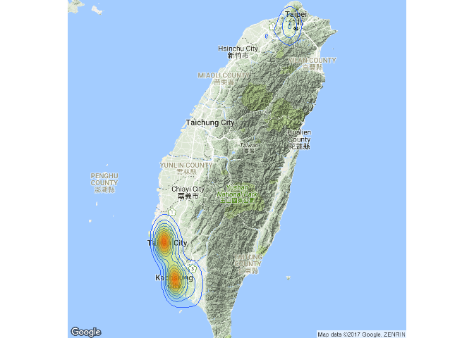

台灣登革熱分析 林昱珊 許凱晶
================

資料來源
--------

1.疾病管制署資料開放平台 2.高雄市政府開放資料 3.政府資料開放平台

分析議題
--------

分析夏天最常見的傳染病-登革熱 登革熱俗稱「天狗熱」或「斷骨熱」 臺灣位於亞熱帶地區，像這樣有點熱、又有點溼的環境，正是蚊子最喜歡的生長環境，為登革熱流行高風險地區。 傳染途徑-&gt;登革熱病患於病發前一天至第五天，血液中含有登革熱病毒，若被叮咬，可將病毒傳給病媒蚊，經由唾液傳給健康民眾。 症狀&gt;症狀:突然發燒≧38℃；頭痛、肌肉痛、關節痛、全身倦怠、出疹 死亡率-&gt; 1. 典型登革熱 : 小孩與老人罹患率較成年人低；致死率低於1% 2. 罹患率以未滿一歲的嬰兒和二到八歲的小孩最高；若無適當治療， 死亡率可達10~50%以上

動機
----

秋夏季節來臨有些疾病也伴隨著而來，我們可以透過此了解夏天常見的傳染病，分析疾病的資料有助於我們對環境的了解，也可以讓我們避免疾病的惡化並改善地區環境的整潔。

假設
----

1.全台的登革熱趨勢是漸緩的 2.登革熱是暑假比較旺盛(大概7~9月) 3.高雄每年都登革熱都居高不下，會是因為醫療分配不足嗎? 4.會不會因為人口密度高的地方登革熱疫情(盛行率)就比較嚴重呢?

分析結果
--------

1.台灣近8年來趨勢呈現波浪形(一下多一下少)，並沒有每年漸緩的趨勢 -&gt;其中，台南差異最大，我們上網查了一下原因，可能的原因有下面幾點: (1)全球爆發登革熱大流行，氣候變遷全球暖化造成超級聖嬰現象為主要原因。據統計聖嬰現象約每 2 至 5 年發生一次，依中央氣象局的預測，2015年夏季開始至2016年春季的聖嬰現象是18 年來最強的一次。 (2)2015 年初水情吃緊，臺南市面臨 10 餘年來最嚴重的乾旱，1至4月下雨天數及降雨少，民眾儲水導致孑孓有孳生的條件。 (3)二個颱風來襲，父親節的蘇迪勒颱風及中秋節的杜鵑颱風，均帶來豐沛的雨量，增添防疫困難度，人力調配困難。 (4)2015 年臺南市流行的是境外移入的新印尼病毒株，以往較不常見，過去臺南未曾流行第二型，民眾多無抗體、免疫力低，不僅社區傳染力強，加上症狀屬非典型的嘔吐及腹瀉，與過去發燒、痠痛不同，醫師較難於第一時間察覺。 2.我們認為可能在暑假期間登革熱疫情較為嚴重，但我們分析高雄的資料發現是在10~12月疫情比較嚴重，由此可得知我們的推論錯誤。 3.從高雄的資料可以看到疫情大部分分布在沿海地區，山區的部分較少，疫情排行前三名為三民區、前鎮區、鳳山區。 4.我們還找了高雄市快篩診所的分布，發現高雄市快篩診所其實分布密度很高，而且在沒有疫情的地區也有快篩診所，因此推斷部會是因為醫療分布不均導致高雄市每年的疫情都如此嚴重。 5.我們分析出來盛行率和人口密度不會成正相關，也就是說人口密度高的地區疫情不一定必較嚴重，反而可能是環境較差的地區以情較嚴重。

讀入資料
--------

``` r
#這是R Code Chunk
library(readr)
```

    ## Warning: package 'readr' was built under R version 3.3.3

``` r
#99~106年高雄登革熱資料
MosIndex_Kaohsiung <- read_csv("C:/Users/user/Downloads/MosIndex_Kaohsiung.csv")
```

    ## Parsed with column specification:
    ## cols(
    ##   .default = col_integer(),
    ##   Date = col_date(format = ""),
    ##   County = col_character(),
    ##   Town = col_character(),
    ##   Village = col_character(),
    ##   VillageID = col_character(),
    ##   VillageLon = col_double(),
    ##   VillageLat = col_double(),
    ##   AreaType = col_character(),
    ##   InspectType = col_character(),
    ##   BI = col_double(),
    ##   AIAeg = col_double(),
    ##   AIAlb = col_double(),
    ##   HI = col_double(),
    ##   HIAeg = col_double(),
    ##   CI = col_double(),
    ##   LI = col_double(),
    ##   AI = col_double(),
    ##   Con100HH = col_double()
    ## )

    ## See spec(...) for full column specifications.

``` r
#104年高雄各地區各月份病例資料
X104dengueinfection <- read_csv("C:/Users/user/Downloads/104dengueinfection.csv")
```

    ## Parsed with column specification:
    ## cols(
    ##   行政區 = col_character(),
    ##   `1月` = col_integer(),
    ##   `2月` = col_integer(),
    ##   `3月` = col_integer(),
    ##   `4月` = col_integer(),
    ##   `5月` = col_integer(),
    ##   `6月` = col_integer(),
    ##   `7月` = col_integer(),
    ##   `8月` = col_integer(),
    ##   `9月` = col_integer(),
    ##   `10月` = col_integer(),
    ##   `11月` = col_integer(),
    ##   `12月` = col_integer(),
    ##   總計 = col_integer()
    ## )

``` r
#台南市、高雄市、屏東縣快篩診所資料
ns1hosp_20160603 <- read_csv("C:/Users/user/Downloads/ns1hosp_20160603.csv")
```

    ## Parsed with column specification:
    ## cols(
    ##   city = col_character(),
    ##   hospName = col_character(),
    ##   hospID = col_character(),
    ##   hospAddress = col_character(),
    ##   lat = col_double(),
    ##   lng = col_double(),
    ##   hospTel = col_character()
    ## )

``` r
#99~106年全台登革熱資料
MosIndex_All <- read_csv("C:/Users/user/Downloads/MosIndex_All.csv")
```

    ## Parsed with column specification:
    ## cols(
    ##   .default = col_integer(),
    ##   Date = col_date(format = ""),
    ##   County = col_character(),
    ##   Town = col_character(),
    ##   Village = col_character(),
    ##   VillageID = col_character(),
    ##   VillageLon = col_character(),
    ##   VillageLat = col_character(),
    ##   AreaType = col_character(),
    ##   InspectType = col_character(),
    ##   BI = col_double(),
    ##   AIAeg = col_double(),
    ##   AIAlb = col_double(),
    ##   HI = col_double(),
    ##   HIAeg = col_double(),
    ##   CI = col_double(),
    ##   LI = col_double(),
    ##   AI = col_double(),
    ##   Con100HH = col_double()
    ## )
    ## See spec(...) for full column specifications.

``` r
#104年全台各鄉鎮市區人口密度
opendata104N010 <- read_csv("C:/Users/user/Downloads/opendata104N010.csv")
```

    ## Parsed with column specification:
    ## cols(
    ##   statistic_yyy = col_character(),
    ##   site_id = col_character(),
    ##   people_total = col_character(),
    ##   area = col_character(),
    ##   population_density = col_character()
    ## )

資料處理與清洗、資料視覺化(99~106年全台登革熱資料)
--------------------------------------------------

``` r
#這是R Code Chunk
library(dplyr)
```

    ## Warning: package 'dplyr' was built under R version 3.3.3

    ## 
    ## Attaching package: 'dplyr'

    ## The following objects are masked from 'package:stats':
    ## 
    ##     filter, lag

    ## The following objects are masked from 'package:base':
    ## 
    ##     intersect, setdiff, setequal, union

``` r
MosIndex_Allc<-select(MosIndex_All,Date:AreaType)
MosIndex_Allc<-MosIndex_Allc[complete.cases(MosIndex_Allc),]
MosIndex_Allc$VillageLon<-as.numeric(MosIndex_Allc$VillageLon)
```

    ## Warning: 強制變更過程中產生了 NA

``` r
MosIndex_Allc$VillageLat<-as.numeric(MosIndex_Allc$VillageLat)
```

    ## Warning: 強制變更過程中產生了 NA

``` r
MosIndex_Allc2010<-MosIndex_Allc[grepl("2010",MosIndex_Allc$Date),]
MosIndex_Allc2011<-MosIndex_Allc[grepl("2011",MosIndex_Allc$Date),]
MosIndex_Allc2012<-MosIndex_Allc[grepl("2012",MosIndex_Allc$Date),]
MosIndex_Allc2013<-MosIndex_Allc[grepl("2013",MosIndex_Allc$Date),]
MosIndex_Allc2014<-MosIndex_Allc[grepl("2014",MosIndex_Allc$Date),]
MosIndex_Allc2015<-MosIndex_Allc[grepl("2015",MosIndex_Allc$Date),]
MosIndex_Allc2016<-MosIndex_Allc[grepl("2016",MosIndex_Allc$Date),]
MosIndex_Allc2017<-MosIndex_Allc[grepl("2017",MosIndex_Allc$Date),]
library(ggmap)
```

    ## Warning: package 'ggmap' was built under R version 3.3.3

    ## Loading required package: ggplot2

    ## Warning: package 'ggplot2' was built under R version 3.3.3

``` r
Taiwanmap <- get_map(location = "Taiwan", zoom = 8)
```

    ## Map from URL : http://maps.googleapis.com/maps/api/staticmap?center=Taiwan&zoom=8&size=640x640&scale=2&maptype=terrain&language=en-EN&sensor=false

    ## Information from URL : http://maps.googleapis.com/maps/api/geocode/json?address=Taiwan&sensor=false

``` r
densityMap0<-ggmap(Taiwanmap,extent = "device")+ 
  geom_density2d(data = MosIndex_Allc2010, aes(x = VillageLon, y = VillageLat), size = 0.3)+
  stat_density2d(data = MosIndex_Allc2010, 
                 aes(x = VillageLon, y = VillageLat, 
                     fill = ..level.., alpha = ..level..), 
                 size = 0.01, bins = 16, geom = "polygon") + 
  scale_fill_gradient(low = "green", 
                      high = "red", guide = FALSE) + 
  scale_alpha(range = c(0, 0.3), guide = FALSE)
```

    ## Warning: `panel.margin` is deprecated. Please use `panel.spacing` property
    ## instead

``` r
densityMap0
```

    ## Warning: Removed 456 rows containing non-finite values (stat_density2d).

    ## Warning: Removed 456 rows containing non-finite values (stat_density2d).


``` r
Taiwanmap <- get_map(location = "Taiwan", zoom = 8)
```

    ## Map from URL : http://maps.googleapis.com/maps/api/staticmap?center=Taiwan&zoom=8&size=640x640&scale=2&maptype=terrain&language=en-EN&sensor=false
    ## Information from URL : http://maps.googleapis.com/maps/api/geocode/json?address=Taiwan&sensor=false

``` r
densityMap1<-ggmap(Taiwanmap,extent = "device")+ 
  geom_density2d(data = MosIndex_Allc2011, aes(x = VillageLon, y = VillageLat), size = 0.3)+
  stat_density2d(data = MosIndex_Allc2011, 
                 aes(x = VillageLon, y = VillageLat, 
                     fill = ..level.., alpha = ..level..), 
                 size = 0.01, bins = 16, geom = "polygon") + 
  scale_fill_gradient(low = "green", 
                      high = "red", guide = FALSE) + 
  scale_alpha(range = c(0, 0.3), guide = FALSE)
```

    ## Warning: `panel.margin` is deprecated. Please use `panel.spacing` property
    ## instead

``` r
densityMap1
```

    ## Warning: Removed 502 rows containing non-finite values (stat_density2d).

    ## Warning: Removed 502 rows containing non-finite values (stat_density2d).



``` r
Taiwanmap <- get_map(location = "Taiwan", zoom = 8)
```

    ## Map from URL : http://maps.googleapis.com/maps/api/staticmap?center=Taiwan&zoom=8&size=640x640&scale=2&maptype=terrain&language=en-EN&sensor=false
    ## Information from URL : http://maps.googleapis.com/maps/api/geocode/json?address=Taiwan&sensor=false

``` r
densityMap2<-ggmap(Taiwanmap,extent = "device")+ 
  geom_density2d(data = MosIndex_Allc2012, aes(x = VillageLon, y = VillageLat), size = 0.3)+
  stat_density2d(data = MosIndex_Allc2012, 
                 aes(x = VillageLon, y = VillageLat, 
                     fill = ..level.., alpha = ..level..), 
                 size = 0.01, bins = 16, geom = "polygon") + 
  scale_fill_gradient(low = "green", 
                      high = "red", guide = FALSE) + 
  scale_alpha(range = c(0, 0.3), guide = FALSE)
```

    ## Warning: `panel.margin` is deprecated. Please use `panel.spacing` property
    ## instead

``` r
densityMap2
```

    ## Warning: Removed 412 rows containing non-finite values (stat_density2d).

    ## Warning: Removed 412 rows containing non-finite values (stat_density2d).


``` r
Taiwanmap <- get_map(location = "Taiwan", zoom = 8)
```

    ## Map from URL : http://maps.googleapis.com/maps/api/staticmap?center=Taiwan&zoom=8&size=640x640&scale=2&maptype=terrain&language=en-EN&sensor=false
    ## Information from URL : http://maps.googleapis.com/maps/api/geocode/json?address=Taiwan&sensor=false

``` r
densityMap3<-ggmap(Taiwanmap,extent = "device")+ 
  geom_density2d(data = MosIndex_Allc2013, aes(x = VillageLon, y = VillageLat), size = 0.3)+
  stat_density2d(data = MosIndex_Allc2013, 
                 aes(x = VillageLon, y = VillageLat, 
                     fill = ..level.., alpha = ..level..), 
                 size = 0.01, bins = 16, geom = "polygon") + 
  scale_fill_gradient(low = "green", 
                      high = "red", guide = FALSE) + 
  scale_alpha(range = c(0, 0.3), guide = FALSE)
```

    ## Warning: `panel.margin` is deprecated. Please use `panel.spacing` property
    ## instead

``` r
densityMap3
```

    ## Warning: Removed 316 rows containing non-finite values (stat_density2d).

    ## Warning: Removed 316 rows containing non-finite values (stat_density2d).


``` r
densityMap4<-ggmap(Taiwanmap,extent = "device")+ 
  geom_density2d(data = MosIndex_Allc2014, aes(x = VillageLon, y = VillageLat), size = 0.3)+
  stat_density2d(data = MosIndex_Allc2014, 
                 aes(x = VillageLon, y = VillageLat, 
                     fill = ..level.., alpha = ..level..), 
                 size = 0.01, bins = 16, geom = "polygon") + 
  scale_fill_gradient(low = "green", 
                      high = "red", guide = FALSE) + 
  scale_alpha(range = c(0, 0.3), guide = FALSE)
```

    ## Warning: `panel.margin` is deprecated. Please use `panel.spacing` property
    ## instead

``` r
densityMap4
```

    ## Warning: Removed 319 rows containing non-finite values (stat_density2d).

    ## Warning: Removed 319 rows containing non-finite values (stat_density2d).


``` r
Taiwanmap <- get_map(location = "Taiwan", zoom = 8)
```

    ## Map from URL : http://maps.googleapis.com/maps/api/staticmap?center=Taiwan&zoom=8&size=640x640&scale=2&maptype=terrain&language=en-EN&sensor=false
    ## Information from URL : http://maps.googleapis.com/maps/api/geocode/json?address=Taiwan&sensor=false

``` r
densityMap5<-ggmap(Taiwanmap,extent = "device")+ 
  geom_density2d(data = MosIndex_Allc2015, aes(x = VillageLon, y = VillageLat), size = 0.3)+
  stat_density2d(data = MosIndex_Allc2015, 
                 aes(x = VillageLon, y = VillageLat, 
                     fill = ..level.., alpha = ..level..), 
                 size = 0.01, bins = 16, geom = "polygon") + 
  scale_fill_gradient(low = "green", 
                      high = "red", guide = FALSE) + 
  scale_alpha(range = c(0, 0.3), guide = FALSE)
```

    ## Warning: `panel.margin` is deprecated. Please use `panel.spacing` property
    ## instead

``` r
densityMap5
```

    ## Warning: Removed 336 rows containing non-finite values (stat_density2d).

    ## Warning: Removed 336 rows containing non-finite values (stat_density2d).


``` r
Taiwanmap <- get_map(location = "Taiwan", zoom = 8)
```

    ## Map from URL : http://maps.googleapis.com/maps/api/staticmap?center=Taiwan&zoom=8&size=640x640&scale=2&maptype=terrain&language=en-EN&sensor=false
    ## Information from URL : http://maps.googleapis.com/maps/api/geocode/json?address=Taiwan&sensor=false

``` r
densityMap6<-ggmap(Taiwanmap,extent = "device")+ 
  geom_density2d(data = MosIndex_Allc2016, aes(x = VillageLon, y = VillageLat), size = 0.3)+
  stat_density2d(data = MosIndex_Allc2016, 
                 aes(x = VillageLon, y = VillageLat, 
                     fill = ..level.., alpha = ..level..), 
                 size = 0.01, bins = 16, geom = "polygon") + 
  scale_fill_gradient(low = "green", 
                      high = "red", guide = FALSE) + 
  scale_alpha(range = c(0, 0.3), guide = FALSE)
```

    ## Warning: `panel.margin` is deprecated. Please use `panel.spacing` property
    ## instead

``` r
densityMap6
```

    ## Warning: Removed 986 rows containing non-finite values (stat_density2d).

    ## Warning: Removed 986 rows containing non-finite values (stat_density2d).


``` r
Taiwanmap <- get_map(location = "Taiwan", zoom = 8)
```

    ## Map from URL : http://maps.googleapis.com/maps/api/staticmap?center=Taiwan&zoom=8&size=640x640&scale=2&maptype=terrain&language=en-EN&sensor=false
    ## Information from URL : http://maps.googleapis.com/maps/api/geocode/json?address=Taiwan&sensor=false

``` r
densityMap7<-ggmap(Taiwanmap,extent = "device")+ 
  geom_density2d(data = MosIndex_Allc2017, aes(x = VillageLon, y = VillageLat), size = 0.3)+
  stat_density2d(data = MosIndex_Allc2017, 
                 aes(x = VillageLon, y = VillageLat, 
                     fill = ..level.., alpha = ..level..), 
                 size = 0.01, bins = 16, geom = "polygon") + 
  scale_fill_gradient(low = "green", 
                      high = "red", guide = FALSE) + 
  scale_alpha(range = c(0, 0.3), guide = FALSE)
```

    ## Warning: `panel.margin` is deprecated. Please use `panel.spacing` property
    ## instead

``` r
densityMap7
```

    ## Warning: Removed 263 rows containing non-finite values (stat_density2d).

    ## Warning: Removed 263 rows containing non-finite values (stat_density2d).


資料處理與清洗、資料視覺化(99~106年高雄登革熱資料)
--------------------------------------------------

``` r
library(dplyr)
MosIndex_Kaohsiungc<-select(MosIndex_Kaohsiung,Date:AreaType)
MosIndex_Kaohsiungc2015<-MosIndex_Kaohsiungc[grepl("2015",MosIndex_Kaohsiungc$Date),]
MosIndex_Kaohsiungc2016<-MosIndex_Kaohsiungc[grepl("2016",MosIndex_Kaohsiungc$Date),]
library(ggmap)
khcmap <- get_map(location ='Kaohsiung', 
                 zoom = 10,
                 language = "zh-TW", maptype = 'roadmap')
```

    ## Map from URL : http://maps.googleapis.com/maps/api/staticmap?center=Kaohsiung&zoom=10&size=640x640&scale=2&maptype=roadmap&language=zh-TW&sensor=false

    ## Information from URL : http://maps.googleapis.com/maps/api/geocode/json?address=Kaohsiung&sensor=false

``` r
khcmap1 <- ggmap(khcmap)+ 
  geom_point(data=MosIndex_Kaohsiungc, 
             aes(x=VillageLon, y=VillageLat),colour="red")
khcmap1
```

    ## Warning: Removed 284 rows containing missing values (geom_point).

 \#\#資料處理與清洗、資料視覺化(104年高雄各地區各月份病例資料)

``` r
X104dengueinfectionC<-select(X104dengueinfection,行政區:`12月`)
library(reshape2)
```

    ## Warning: package 'reshape2' was built under R version 3.3.3

``` r
X104dengueinfectionM<-melt(X104dengueinfectionC,id.vars = "行政區")
X104dengueinfectionM1<-X104dengueinfectionM[grepl("區",X104dengueinfectionM$行政區),]
#104年各月份高雄地區的病例數
test<-group_by(X104dengueinfectionM1,variable) %>%
  summarise(次數=sum(value,na.rm=T))%>%
  arrange(desc(次數))
test
```

    ## # A tibble: 12 × 2
    ##    variable  次數
    ##      <fctr> <int>
    ## 1      11月  8909
    ## 2      10月  5139
    ## 3      12月  2953
    ## 4       9月  2112
    ## 5       8月   440
    ## 6       1月    70
    ## 7       6月    31
    ## 8       7月    29
    ## 9       5月    18
    ## 10      2月    10
    ## 11      3月     7
    ## 12      4月     5

``` r
ggplot()+geom_bar(data=test,aes(x= variable,y= 次數),
                  stat = "identity")+xlab("月份")
```


``` r
#104年高雄各地區的總病例
test1<-group_by(X104dengueinfectionM1,.dots=行政區) %>%
 summarise(病例=sum(value,na.rm=T)) %>%
    arrange(desc(病例))
test1<-rename(test1,site_id=.dots)
test1
```

    ## # A tibble: 36 × 2
    ##    site_id  病例
    ##      <chr> <int>
    ## 1   三民區  4692
    ## 2   前鎮區  2722
    ## 3   鳳山區  2512
    ## 4   苓雅區  2257
    ## 5   鼓山區  1380
    ## 6   左營區  1288
    ## 7   小港區   913
    ## 8   楠梓區   630
    ## 9   新興區   473
    ## 10  前金區   324
    ## # ... with 26 more rows

資料處理與清洗、資料視覺化(台南市、高雄市、屏東縣快篩診所資料)
--------------------------------------------------------------

``` r
ns1hosp_20160603K<- ns1hosp_20160603[grep("高雄市",ns1hosp_20160603$city),]
#登革熱快篩所與病例分布
library(ggmap)
Kaohsiungmap <- get_map(location = "Kaohsiung", zoom = 10,
                        language = "zh-TW", maptype = "roadmap")
```

    ## Map from URL : http://maps.googleapis.com/maps/api/staticmap?center=Kaohsiung&zoom=10&size=640x640&scale=2&maptype=roadmap&language=zh-TW&sensor=false

    ## Information from URL : http://maps.googleapis.com/maps/api/geocode/json?address=Kaohsiung&sensor=false

``` r
#紅色是病例，綠色是快篩所
Kaohsiungmap0 <- ggmap(Kaohsiungmap)+ 
  geom_point(data=MosIndex_Kaohsiungc2015, 
             aes(x = VillageLon, y = VillageLat),
             colour="red",size=1.2)+
  geom_point(data=ns1hosp_20160603K, 
             aes(x = lng, y = lat),
             colour="green",size=1.2)
Kaohsiungmap0
```

    ## Warning: Removed 3 rows containing missing values (geom_point).

 \#\#資料處理與清洗、資料視覺化(104年全台各鄉鎮市區人口密度)

``` r
opendata104N010C<-opendata104N010[grepl("高雄市",opendata104N010$site_id),]
opendata104N010C<-opendata104N010C[complete.cases(opendata104N010C$statistic_yyy),]
opendata104N010C$site_id<-substr(opendata104N010C$site_id,start = 4,stop = 7)
a<-full_join(opendata104N010C,test1,by="site_id")
a<-mutate(a,盛行率=病例/as.numeric(people_total))
a
```

    ## # A tibble: 38 × 7
    ##    statistic_yyy site_id people_total    area population_density  病例
    ##            <chr>   <chr>        <chr>   <chr>              <chr> <int>
    ## 1            104  鹽埕區        25032  1.4161              17677   249
    ## 2            104  鼓山區       136665 14.7523               9264  1380
    ## 3            104  左營區       196244 19.3823              10125  1288
    ## 4            104  楠梓區       179931 25.8276               6967   630
    ## 5            104  三民區       346169 19.7866              17495  4692
    ## 6            104  新興區        51955  1.9764              26288   473
    ## 7            104  前金區        27388  1.8573              14746   324
    ## 8            104  苓雅區       174515  8.1522              21407  2257
    ## 9            104  前鎮區       192593 19.1207              10072  2722
    ## 10           104  旗津區        29008  1.4639              19816   190
    ## # ... with 28 more rows, and 1 more variables: 盛行率 <dbl>

工作分配
--------

林昱珊-構思、找資料、coding 許凱晶-構思、找資料、作圖、PPT、報告
